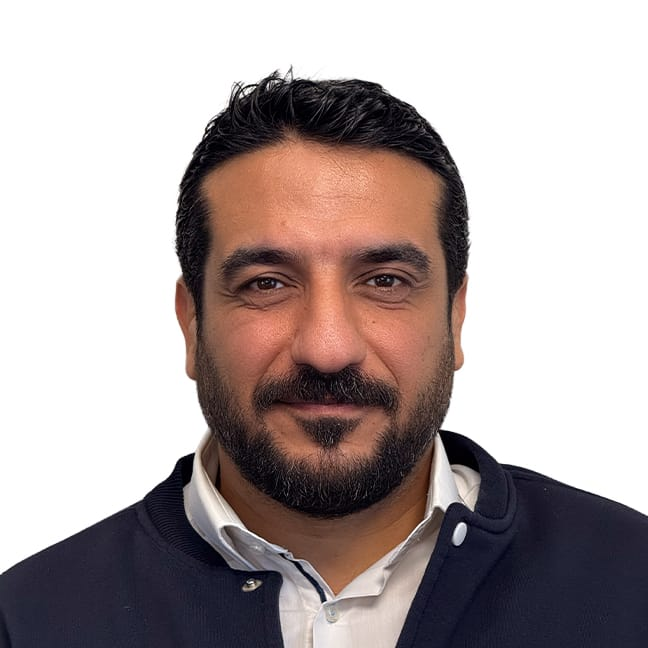

```{r}

```

---
title: "Hakkımda"
sidebar: false 
---

{fig-align="center"}

# Eğitim

-   B.S., Fırat University, Turkey, 2002 - 2009.
-   M.S., Industrial Engineering, Hacettepe University, Turkey, 2026 - ongoing.

# İş Tecrübesi

## Employements

1.  Türk Telekom, Senior Network Engineer, 2010-2016

2.  ATOS, Senior Network Engineer, 2016-2017

3.  Techsquare IT Solutions, Consultant, 2017-2021

4.  BİTES Aerospace&Defence, Systems Engineering Group Lead, 2021-On Going

## Internships

1.  Türk Telekom A.Ş., İntern Engineer, 2004

2.  Keban HES, İntern Engineer, 2005

# Projects

1.  

# Publications

1.  

# Competencies

R, Quarto, Git, C++

# Hobbies

Fishing, Motorcycles, Nature Sports.
